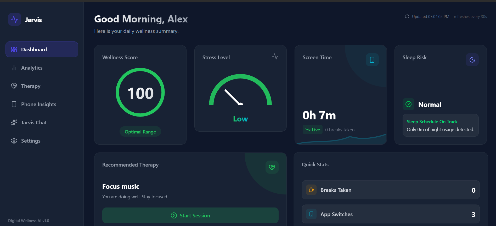
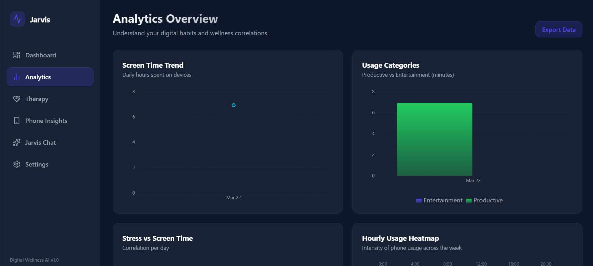
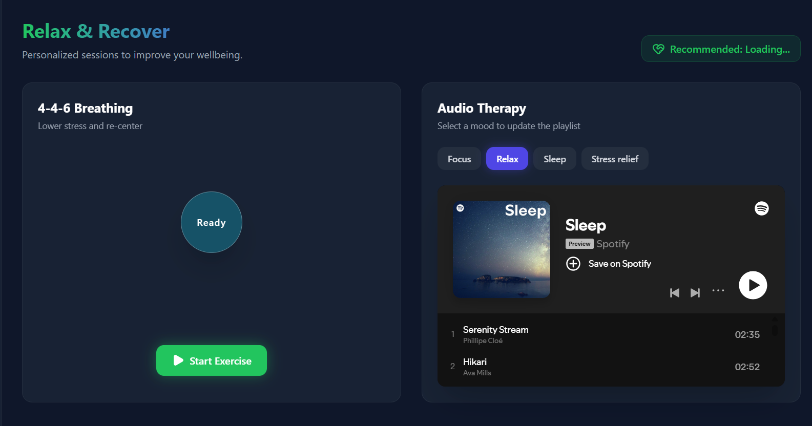
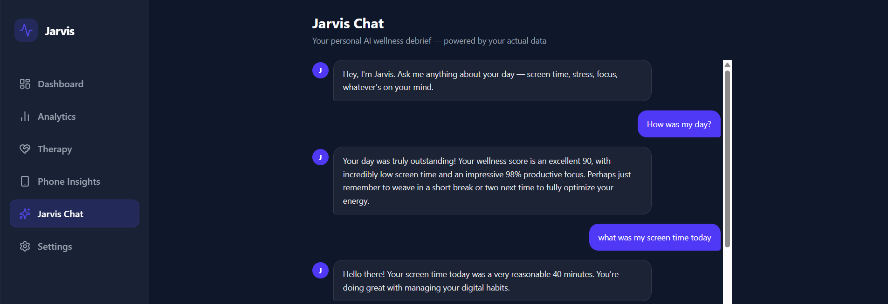
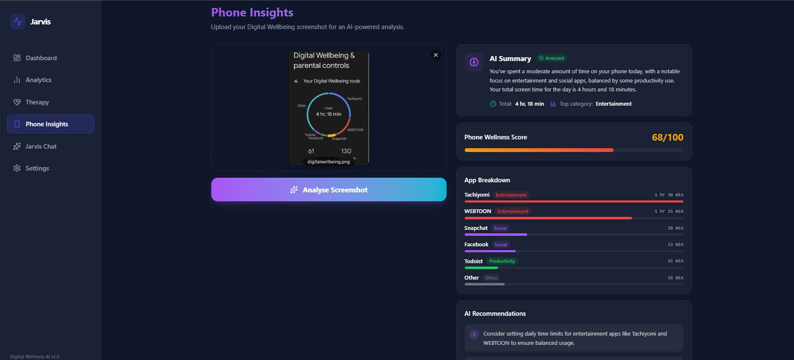
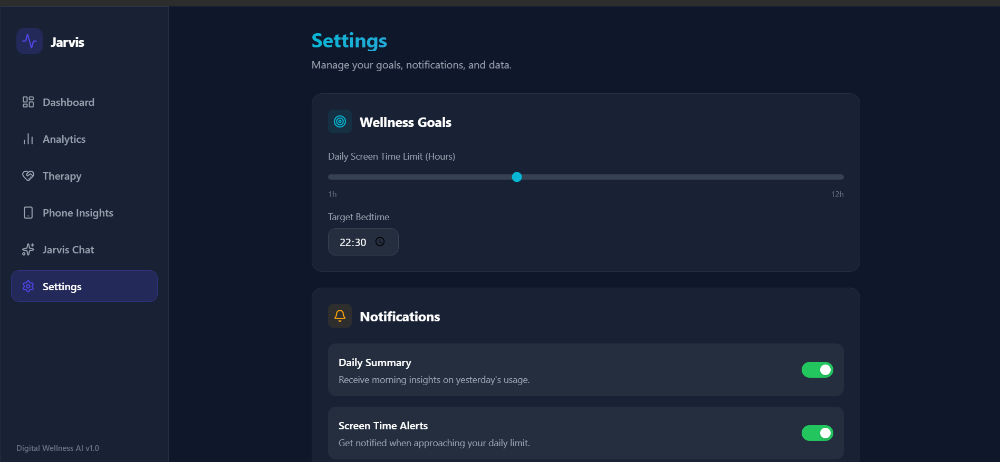

# 🧠 JARVIS — AI Digital Wellness System

An AI-powered digital wellness platform that tracks screen usage across devices, predicts stress levels using machine learning, and provides actionable insights to improve focus, productivity, and digital habits.

---

## 📸 Screenshots

### Dashboard



### Analytics



### Therapy / Insights



### Chat Assistant



### Phone Insights



### Settings



---

## 🚀 Key Features

* 📊 **Real-time Activity Tracking**
  Tracks PC and mobile app usage (via ADB), logging behavior every 5 seconds

* 🧠 **ML-Based Stress Prediction**
  Decision Tree model predicts fatigue levels (Low / Medium / High) using behavioral patterns

* 📈 **Dynamic Wellness Score**
  Live score (0–100) based on screen time, focus, breaks, and night usage

* 🤖 **AI-Powered Phone Insights**
  Uses Gemini Vision AI to analyze Digital Wellbeing screenshots and generate recommendations

* 🔔 **Smart Alerts & Notifications**
  Context-aware reminders like breaks, hydration, and focus alerts

* 🎨 **Modern Interactive UI**
  Glassmorphic dashboard with animations, charts, and real-time insights

---

## 🧠 How It Works

JARVIS combines **real-time tracking + ML + AI insights**:

* Logs user activity continuously across devices
* Extracts behavioral features (screen time, breaks, app switches)
* Applies ML model for stress classification
* Computes wellness score using rule-based penalties
* Enhances insights using Gemini AI for visual analysis

---

## 🛠️ Tech Stack

| Layer        | Technologies                                       |
| ------------ | -------------------------------------------------- |
| **Frontend** | React (Vite), TailwindCSS, Framer Motion, Recharts |
| **Backend**  | Python, Flask, Flask-CORS                          |
| **ML**       | Scikit-learn (Decision Tree), Joblib               |
| **Data**     | Pandas, Pillow                                     |
| **AI**       | Google Gemini (`gemini-2.5-flash`)                 |

---

## ⚙️ Setup

### 1️⃣ Clone the repo

```bash
git clone https://github.com/your-username/JARVIS.git
cd JARVIS
```

---

### 2️⃣ Backend setup

```bash
cd Jarvis-backend-main/backend
pip install Flask flask-cors pandas scikit-learn joblib pillow google-generativeai python-dotenv
```

Create `.env` in `backend/api`:

```env
GEMINI_API_KEY=your_api_key_here
```

Run:

```bash
python api/app.py
```

(Optional trackers)

```bash
python api/tracker.py
python api/phone_tracker.py
```

---

### 3️⃣ Frontend setup

```bash
cd Jarvis-main
npm install
npm run dev
```

---

## 📂 Project Structure

```
JARVIS/
├── Jarvis-main/           # React frontend
├── Jarvis-backend-main/   # Flask backend + ML
├── Screenshots/           # UI images
└── formulas_and_ml_analysis.md
```

---

## 💡 Why JARVIS?

JARVIS goes beyond simple screen-time tracking. It helps users:

* Understand digital behavior patterns
* Detect early signs of burnout
* Improve productivity with data-driven insights
* Maintain a healthier digital lifestyle

---

## ⚠️ Note

This system provides behavioral insights and is not a medical diagnostic tool.

---

⭐ *Helping users build healthier relationships with technology*
