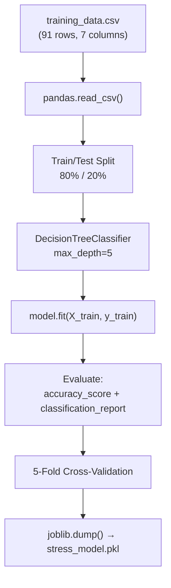

# JARVIS — Formulas, Scoring & ML Model Deep Dive

---

## 1. Feature Computation Formulas

Every 5 seconds, the tracker logs one row to [activity_log.csv](file:///c:/Users/swaroop/Downloads/JARVIS_FINAL_FINAL/Jarvis-backend-main/backend/api/activity_log.csv). The backend reads today's rows and computes **6 features** using the formulas below.

> Source: [compute_features_for_group](file:///c:/Users/swaroop/Downloads/JARVIS_FINAL_FINAL/Jarvis-backend-main/backend/api/app.py#L50-L100)

### 1.1 Screen Time (minutes)

```
screen_time = (number_of_log_entries × 5) / 60
```

Each log entry = 5 seconds of active use. Divide by 60 to get **minutes**.

| Example | Calculation | Result |
|---------|------------|--------|
| 720 entries logged today | 720 × 5 / 60 | **60 min** |
| 2880 entries | 2880 × 5 / 60 | **240 min (4 hours)** |

PC and phone screen time are computed the same way but filtered by `source`:
```
pc_screen_time   = (entries where source='pc')   × 5 / 60
phone_screen_time = (entries where source='phone') × 5 / 60
```

### 1.2 Continuous Usage (minutes)

Measures the **longest unbroken streak** of activity — the longest period without a gap > 5 minutes.

```python
for each row (sorted by timestamp):
    gap = time_since_previous_row (seconds)
    if gap <= 300:           # still in same session
        current_streak += 5  # add 5 seconds
    else:
        current_streak = 5   # start new session
    max_streak = max(max_streak, current_streak)

continuous_usage = max_streak / 60  # convert to minutes
```

| Example | Meaning |
|---------|---------|
| continuous_usage = 45.0 | Longest unbroken session was 45 minutes |
| continuous_usage = 120.0 | User sat for 2 hours straight without a 5-min break |

### 1.3 Night Usage (minutes)

Counts log entries recorded **at or after 10 PM** (hour ≥ 22).

```
night_entries = entries where timestamp.hour >= 22
night_usage = (night_entries × 5) / 60
```

### 1.4 App Switches (count)

Counts how many times the base app changed (e.g., Chrome → VS Code → Spotify).

```python
raw_switches = count of (base_app[i] != base_app[i-1])

# Capped to prevent noise from tab/file title changes:
max_reasonable = max(1, total_entries × 5 / 120)   # 1 switch per 2 minutes max

app_switches = min(raw_switches, max_reasonable)
```

> **Why cap it?** Window titles change rapidly (new tab, new file), creating false "switches". The cap limits it to 1 switch per 2 minutes.

### 1.5 Breaks (count)

A **break** = any gap between consecutive log entries **greater than 5 minutes** (300 seconds).

```
breaks = count of (gap_between_rows > 300 seconds)
```

### 1.6 Productive Ratio (0.0 – 1.0)

Measures the fraction of time **NOT** spent on distracting apps.

```
distracting_apps = ["YouTube", "Instagram", "Netflix", "Twitter", "TikTok", "Facebook", "WhatsApp"]

distracting_count = entries matching any distracting app name (case-insensitive)

productive_ratio = 1 - (distracting_count / total_entries)
```

| Example | Calculation | Result |
|---------|------------|--------|
| 100 entries, 30 on YouTube | 1 - (30/100) | **0.70** (70% productive) |
| 100 entries, 80 on Instagram | 1 - (80/100) | **0.20** (only 20% productive) |

---

## 2. Wellness Score Formula (0 – 100)

The wellness score starts at **100** and gets penalised or boosted by 5 factors.

> Source: [compute_wellness_score](file:///c:/Users/swaroop/Downloads/JARVIS_FINAL_FINAL/Jarvis-backend-main/backend/api/app.py#L114-L131)

```
score = 100

# 1. Stress Penalty (biggest factor)
score -= { High: 40, Medium: 20, Low: 0 }

# 2. Screen Time Penalty (kicks in after 4 hours)
if screen_hours > 4:
    score -= min(20, (screen_hours - 4) × 5)

# 3. Night Usage Penalty (3 points per 10 minutes, max 15)
score -= min(15, (night_usage_minutes / 10) × 3)

# 4. Productivity Bonus (up to +10)
score += productive_ratio × 10

# 5. Break Bonus (up to +5)
score += min(5, breaks × 1.5)

# Clamp to 0-100
score = clamp(score, 0, 100)
```

### Worked Example

Suppose today's data shows:
- Stress level: **Medium** → penalty = 20
- Screen time: **300 min** (5 hours) → screen_hours = 5, penalty = min(20, (5-4)×5) = **5**
- Night usage: **20 min** → penalty = min(15, (20/10)×3) = **6**
- Productive ratio: **0.70** → bonus = 0.70 × 10 = **+7**
- Breaks: **3** → bonus = min(5, 3×1.5) = **+4.5**

```
score = 100 - 20 - 5 - 6 + 7 + 4.5 = 80.5 → rounded to 81
```

### Score Ranges (displayed on Dashboard)

| Score | Label | Color |
|-------|-------|-------|
| 80–100 | Optimal Range | 🟢 Green |
| 60–79 | Good | 🟡 Yellow-green |
| 40–59 | Moderate | 🟠 Orange |
| 0–39 | Needs Attention | 🔴 Red |

---

## 3. ML Stress Prediction Model

### 3.1 Algorithm

| Property | Value |
|----------|-------|
| Algorithm | **Decision Tree Classifier** (`sklearn.tree.DecisionTreeClassifier`) |
| Max Depth | **5** (limits tree depth to prevent overfitting) |
| Random State | 42 (reproducible results) |
| Train/Test Split | 80% train / 20% test |
| Cross-Validation | 5-fold |
| Serialization | Joblib → [stress_model.pkl](file:///c:/Users/swaroop/Downloads/JARVIS_FINAL_FINAL/Jarvis-backend-main/backend/ml/stress_model.pkl) |

### 3.2 Why a Decision Tree?

- **Interpretable**: You can explain *why* a prediction was made (e.g., "screen_time > 400 AND night_usage > 50 → High")
- **Fast inference**: Prediction takes microseconds — perfect for a real-time dashboard
- **Works with small datasets**: Only 91 training samples — complex models like neural nets would overfit badly
- **No feature scaling needed**: Trees don't care about feature magnitudes

### 3.3 Input Features (6)

| # | Feature | Unit | Range in Training Data | What It Measures |
|---|---------|------|----------------------|-----------------|
| 1 | `screen_time` | minutes | 33 – 744 | Total active screen time |
| 2 | `continuous_usage` | minutes | 6 – 197 | Longest unbroken session |
| 3 | `night_usage` | minutes | 0 – 130 | Usage after 10 PM |
| 4 | `app_switches` | count | 9 – 257 | App context changes |
| 5 | `breaks` | count | 0 – 18 | 5-min+ gaps in activity |
| 6 | `productive_ratio` | 0.0–1.0 | 0.06 – 0.98 | Fraction of productive time |

### 3.4 Output Labels (3 classes)

| Label | Count in Training Data | Typical Pattern |
|-------|----------------------|----------------|
| **Low** | ~30 rows | screen_time < 280 min, breaks ≥ 4, productive_ratio > 0.65 |
| **Medium** | ~30 rows | screen_time 200–440 min, moderate night usage, productive_ratio 0.30–0.65 |
| **High** | ~31 rows | screen_time > 400 min, continuous_usage > 100 min, night_usage > 40 min, productive_ratio < 0.35 |

### 3.5 How Prediction Works at Runtime

```python
# predictor.py
model = joblib.load("stress_model.pkl")   # loaded once at startup

def predict_stress_from_tracker(screen_time, continuous_usage, night_usage,
                                 app_switches, breaks, productive_ratio):
    features = [[screen_time, continuous_usage, night_usage,
                  app_switches, breaks, productive_ratio]]
    prediction = model.predict(features)[0]   # returns "Low", "Medium", or "High"
    return prediction
```

The model traverses the decision tree using the 6 feature values and lands on a leaf node labeled Low, Medium, or High.

### 3.6 Training Pipeline



### 3.7 Key Decision Boundaries (Intuitive)

Based on the training data patterns, the tree likely learns splits like:

```
if screen_time > ~450 AND productive_ratio < 0.35:
    → HIGH stress
elif continuous_usage > ~90 AND night_usage > ~40:
    → HIGH stress
elif screen_time > ~250 AND night_usage > ~20 AND productive_ratio < 0.65:
    → MEDIUM stress
else:
    → LOW stress
```

> These are approximate — the actual splits depend on the trained tree. You can visualize the exact tree with `sklearn.tree.plot_tree(model)`.

---

## 4. Alert Threshold Summary

> Source: [get_alerts](file:///c:/Users/swaroop/Downloads/JARVIS_FINAL_FINAL/Jarvis-backend-main/backend/api/app.py#L288-L421)

| Alert | Formula / Condition | Min Data Required |
|-------|--------------------|--------------------|
| Stress Spike 🔴 | `stress_level == "High"` | 15 min screen time |
| Fatigue Building ⚠️ | `stress_level == "Medium"` | 15 min screen time |
| Long Unbroken Session 😵 | `continuous_usage >= 90 min` | 15 min screen time |
| Take a Break 🪑 | `continuous_usage >= 45 min` | 15 min screen time |
| 6 Hours on Screen | `screen_time / 60 >= 6 hours` | 15 min screen time |
| 4 Hour Mark ⏱️ | `screen_time / 60 >= 4 hours` | 15 min screen time |
| Hydration Check 💧 | `screen_time / 60 >= 2 hours` | 15 min screen time |
| Heavy Late Night 🌙 | `night_usage >= 45 min` | 15 min screen time |
| Night Owl 🌙 | `current_hour >= 22 AND night_usage > 0` | 15 min screen time |
| Distraction Mode 📵 | `productive_ratio < 0.30` | **30 min** screen time |
| Heavy Phone 📱 | `phone_screen_time >= 120 min` | 15 min screen time |
| Wellness Critical 🚨 | `wellness_score < 40` | 15 min screen time |
| Crushing It 🎯 | `wellness >= 85 AND stress == Low` | **30 min** screen time |

> **Why 15-min minimum?** Prevents false alerts from triggering during the first few minutes of tracking when data is sparse.

---

## 5. Phone Notification Formula (ADB)

> Source: [phone_tracker.py](file:///c:/Users/swaroop/Downloads/JARVIS_FINAL_FINAL/Jarvis-backend-main/backend/api/phone_tracker.py#L93-L137)

The phone tracker sends push notifications to the connected phone:

```
For each distracting app (YouTube, Instagram, Netflix, etc.):
    usage_mins = (today's entries for this app × 5) / 60
    current_bucket = floor(usage_mins / 10) × 10    # 10, 20, 30, 40...

    if current_bucket > last_notified_bucket:
        send notification to phone via ADB

    Tone varies:
        ≤ 20 min: "Still okay, but stay aware."
        ≤ 40 min: "Wellness at {score}/100 — consider a break."
        > 40 min: "Wellness dropping to {score}/100. Put it down."
```

---

## 6. Gemini Vision AI (Phone Insights)

> Source: [analyze_screenshot](file:///c:/Users/swaroop/Downloads/JARVIS_FINAL_FINAL/Jarvis-backend-main/backend/api/app.py#L535-L587)

| Property | Value |
|----------|-------|
| Model | `gemini-2.5-flash` |
| Input | Uploaded screenshot image (PNG/JPG/WebP) |
| Prompt | Structured prompt requesting JSON output with summary, apps, recommendations, wellness_score |
| Post-processing | Strip markdown code fences → `json.loads()` → return to frontend |

The AI doesn't use any hardcoded formula — it interprets the visual content of the Digital Wellbeing screenshot and returns a wellness score (0–100) based on its own assessment of the usage patterns shown in the image.
